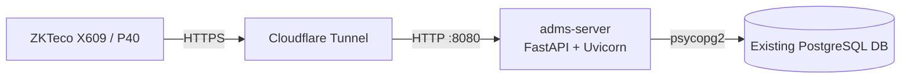

# ADMS Server

A lightweight, self-hosted **Attendance Device Management System (ADMS)** server for ZKTeco biometric devices. It receives real-time attendance pushes over the ZKTeco Push SDK protocol and writes them straight into an existing PostgreSQL database — no ORM, no schema ownership, no auto-created tables. You bring the database, this server just feeds it.

Built and tested against the **ZKTeco X609** and **ZKTeco P40**, both of which speak the same Push SDK protocol, so other compatible ZKTeco models should work with little to no changes.

## Why this exists

Most ADMS options are either the vendor's closed, Windows-only software or heavyweight open-source suites that want to own your database schema. This project takes a narrower approach: it's a small, containerized bridge that speaks the ZKTeco `iclock` protocol on one side, and writes plain rows into a table you already manage on the other. If you already run your own attendance/reporting database and just need a reliable way to get punches into it, this is meant to be that.

## Features

- 🔌 **Drop-in ZKTeco Push SDK compatibility** — implements the `iclock` endpoints devices expect (`cdata`, `getrequest`) so devices can be pointed at it with zero firmware changes.
- 🗄️ **Bring your own database** — connects to a pre-existing PostgreSQL database via `psycopg2`. The server never creates or migrates tables; it only inserts into a table you already have.
- ⚙️ **Fully configurable via `.env`** — connection parameters and even column name mappings are environment-driven, so it can adapt to whatever schema you already run.
- 🐳 **Docker-first** — ships as a Docker Compose service, designed to sit behind a reverse proxy / tunnel rather than terminate TLS itself.
- ☁️ **Cloudflare Tunnel friendly** — the reference deployment terminates TLS at Cloudflare and proxies plain HTTP internally, avoiding the complexity (and device compatibility issues) of terminating TLS at the app.
- 🧩 **No unnecessary dependencies** — plain FastAPI + Uvicorn + psycopg2. No SQLAlchemy, no bundled database container.

## Architecture



- Devices are configured with a plain hostname, e.g. `https://adms.yourdomain.com` — **no port** in the device config.
- **Cloudflare Tunnel (`cloudflared`)** handles all external TLS termination and forwards to the app container over plain HTTP inside a private Docker network.
- The **app container** (`d2-adms-server`) is attached only to the tunnel's Docker network, exposes port `8080` internally (`expose`, not `ports` — nothing is published to the host), and never terminates TLS itself.
- The server inserts parsed attendance records directly into a table you already manage — it does not own or create your schema.

This split matters in practice: **Uvicorn alone cannot terminate TLS**, and pointing a device's HTTPS config straight at a plain HTTP Uvicorn listener produces `Invalid HTTP request` errors on the device side. Terminating TLS at the tunnel (or any reverse proxy) sidesteps that entirely.

## Prerequisites

- Docker & Docker Compose
- A PostgreSQL database you already manage, reachable from the server, with a table to receive attendance logs
- A domain (or subdomain) if you intend to expose the server externally — Cloudflare Tunnel is the reference setup, but any TLS-terminating reverse proxy works the same way
- A ZKTeco device using the Push SDK protocol (tested: X609, P40)

## Getting started

```bash
git clone https://github.com/<your-username>/adms-server.git
cd adms-server
cp .env.example .env
# edit .env with your database connection details and column mappings
docker compose up -d --build
```

Once running, point your ZKTeco device's Cloud Server / ADMS setting at your server's public address (e.g. `https://adms.yourdomain.com`, no port) and the device will begin pushing attendance data.

## Configuration

All configuration lives in `.env`. At minimum you'll need:

| Variable | Description |
|---|---|
| `DB_HOST` | PostgreSQL host |
| `DB_PORT` | PostgreSQL port |
| `DB_NAME` | Database name |
| `DB_USER` | Database user |
| `DB_PASSWORD` | Database password |
| `DB_TABLE` | Target table name (default: `adms_logs`) |
| `COL_USER_ID` | Column name mapped to the device's user/enrollment ID |
| `COL_DATE` | Column name mapped to the punch date/time |
| `COL_CHECK_LOGS` | Column name mapped to the raw check-log payload |
| `COL_DEVICE_SN` | Column name mapped to the device serial number |

> Column *names* are configurable — this lets the server target whatever schema you already have, without dictating one of its own.

## Database expectations

The server assumes the target table already exists — **it will not create, alter, or migrate anything**. A minimal compatible schema looks like:

```sql
CREATE TABLE adms_logs (
    id          SERIAL PRIMARY KEY,
    user_id     TEXT NOT NULL,
    date        TIMESTAMP NOT NULL,
    check_logs  TEXT,
    device_sn   TEXT NOT NULL
);
```

Adjust column names to match your own schema and reflect them in `.env`.

## Device configuration notes

- Configure devices with the **hostname only** (e.g. `adms.yourdomain.com`), letting the tunnel/reverse proxy handle the port and TLS.
- Devices connecting by **IP address** (rather than hostname) do not send SNI during the TLS handshake — relevant only if you ever terminate TLS somewhere closer to the server instead of at a tunnel/CDN edge.
- The server always responds `OK` with no payload on `/iclock/getrequest` and never issues time-sync commands — device-side clock behavior is independent of anything this server does.

## Known device quirks

- On both the X609 and P40, `OPERLOG` type `4` entries have been observed with a roughly one-hour timestamp drift, likely due to two unsynchronized internal time references on the device. `OPERLOG` type `21` entries have not shown this issue.
- This does **not** affect data stored by this server, since only `ATTLOG` (attendance) entries are persisted — `OPERLOG` entries are not stored.
- Whether `ATTLOG` timestamps are also subject to drift hasn't been confirmed yet; this needs a real fingerprint/card punch to verify against a known-correct clock.

## Roadmap

- [ ] Capture and verify a real `table=ATTLOG` push to confirm whether attendance timestamps are affected by the same clock drift seen in `OPERLOG`
- [ ] Command queue support (`/iclock/getrequest` currently always returns an empty `OK` — no outbound device commands are issued yet)

## Contributing

Issues and pull requests are welcome, especially from anyone running other ZKTeco Push SDK devices — reports of compatibility (or incompatibility) with other models are particularly useful.

## License

Licensed under the [MIT License](LICENSE).

## Acknowledgments

- Built against the ZKTeco Push SDK protocol used by the X609 and P40 attendance terminals.
